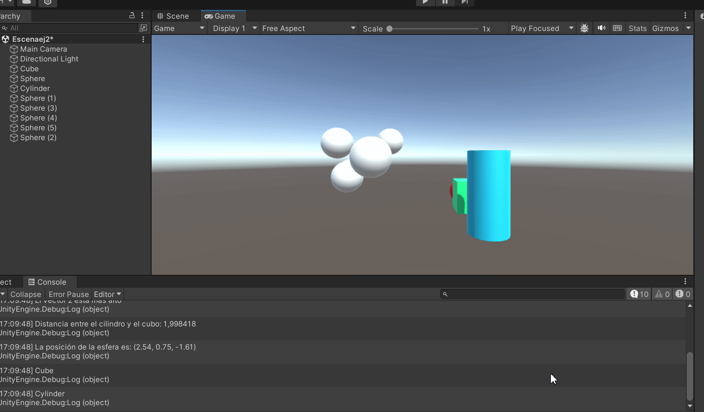

# Practica2II

En esta práctica hago 8 ejercicios de C# y Unity, los cuales están divididos en los distintos scripts que se encuentrán en este repositorio. A su vez a continuación el gif que muestra el resultado de alguno de ellos:

